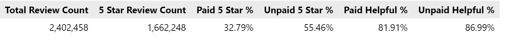

# Amazon Web Services Relational Database ETL
## Paid Amazon Review Analysis 🛒🛍️

## Overview of the analysis of the Vine program:

This analysis compares paid and unpaid reviews from a dataset of 2 million reviews of grocery items. Specifically, we investiage paid reviews from the Vine program have a higher percentage of 5-stars compared to unpaid reviews. According to Amazon's information about the program, "Amazon Vine invites the most trusted reviewers on Amazon to post opinions about products to help their fellow customers make informed purchase decisions." Since trustworthiness and helpfulness are key to this program, we will be looking for any bias in the star ratings and the feedback on helpfulness for the reviews. 

## Results:

### Data Set
* There were **2.4 million total reviews**, **16 thousand Vine reviews**, and **2.3 million non-Vine reviews**. This under representation of paid reviews compared to unpaid reviews can temper the results of this analysis; that is, a slight difference between the two categories is less meaningful than if the two categories had been equally represented. 

### Stars
* To look at count and percentage of 5 star ratings, we first filtered the data to include reviews with a helpfulness rating of over 50% and a helpfulness rating count of over 20. This allows us to look at the most impactful reviews for both Vine and non-Vine. 
* This filtering left **61 Vine reviews** and **28 thousand non-Vine reviews**.
* Of these reviews, **20 Vine reviews were 5 stars** and **15 thousand non-Vine reviews were 5 stars**.
* **32% of paid reviews** were 5 stars while **55% of unpaid reviews** were 5 stars. 

### Helpfulness
* To look at percentage of helpfulness, we had a broader filter: reviews with any amount of helpfulness ratings were included.
* This filtering left **4 thousand Vine reviews** and **871 thousand non-Vine reviews**
* We then found the percentage of helpful votes for each review and took the mean for paid and unpaid reviews.
* Paid reviews had an average helpfulness of **81%** while unpaid reviews had an average helpfulness rating of **86%**.

## Summary:

There does not appear to be bias towards a higher star rating from Vine program reviews; in fact, the paid reviews are significantly less likely to be 5 stars. This aligns with the program's goal of providing trustworthy reviews from helpful reviewers.

As mentioned above, the under representation of the Vine reviews can impact how well we can compare the two groups. To solve for this, further analyses could explore over or under sampling to create more similarly sized groups. 
